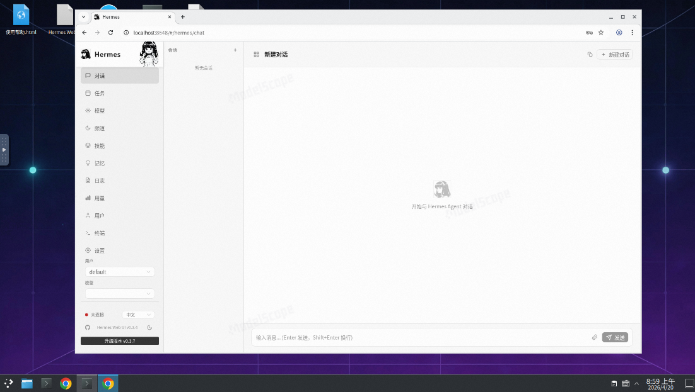

# hermes-agent-desktop

基于 [openclaw_computer](https://github.com/TunMax/openclaw_computer) + [NousResearch/hermes-agent](https://github.com/NousResearch/hermes-agent) + [Hermes WebUI](https://github.com/EKKOLearnAI/hermes-web-ui) 打包的一体化 Docker 镜像。



## 镜像地址

```
ghcr.io/comedy1024/hermes-agent-desktop:latest
```

## 功能特性

- 🖥️ **Linux GUI 桌面** — 通过 noVNC 在浏览器中访问完整 Debian 12 KDE 桌面环境
- 🤖 **Hermes Agent** — 自演化 AI Agent 框架，支持 OpenAI / Anthropic / DeepSeek / Ollama 等
- 🌐 **Hermes WebUI** — 社区最活跃的 Hermes Agent Web 管理界面（769+ Stars）
- 🔧 **全功能管理** — Web 终端、平台频道配置（8平台）、使用分析、定时任务、模型管理
- 🔗 **Gateway API** — OpenAI 兼容 API，供 WebUI 和外部调用
- ☁️ **云平台友好** — noVNC (WebSocket VNC) 完美兼容 ModelScope/HuggingFace 等单端口 HTTP 反代平台
- 🚀 **开箱即用** — 预装 Chrome、fcitx5 中文输入、桌面快捷方式、自动启动

## 远程桌面方案：noVNC + TigerVNC

> **为什么选 openclaw_computer？**
>
> 之前的方案使用 linuxserver/baseimage-kasmvnc，在云平台（ModelScope/HuggingFace）上遇到了严重的权限问题：
> - 云平台 overlayFS 阻止非 root 用户访问系统目录
> - abc 用户无法运行 KDE（`/config` 不可写、`/defaults/` permission denied、XDG_RUNTIME_DIR UID 不匹配）
> - 经过 6+ 轮权限修复仍无法根本解决
>
> openclaw_computer 以 root 运行一切，在 ModelScope 上已验证可行，且预装了 Chrome、fcitx5 等常用工具。

## 端口说明

| 端口 | 服务 | 说明 |
|------|------|------|
| `7860` | noVNC | Debian KDE 桌面（浏览器访问，HTTP + WebSocket） |
| `8648` | Hermes WebUI | Web 管理界面（聊天/配置/运维）|
| `8642` | Hermes Gateway | OpenAI 兼容 API（WebUI 自动管理）|

> 💡 ModelScope/HuggingFace 部署时，端口 7860 已是云平台默认端口，无需额外配置。

## 快速开始（本地运行）

```bash
docker run -d \
  --name hermes-agent \
  -p 7860:7860 \
  -p 8648:8648 \
  -p 8642:8642 \
  -e OPENAI_API_KEY=sk-xxx \
  -e GATEWAY_ALLOW_ALL_USERS=true \
  ghcr.io/comedy1024/hermes-agent-desktop:latest
```

> ⚠️ `GATEWAY_ALLOW_ALL_USERS=true` 是必须配置的，否则 Gateway 会拒绝所有请求。详见 [配置 LLM 模型](#配置-llm-模型)。

启动后：
1. 打开 `http://localhost:7860` — Linux KDE 桌面（noVNC，自动连接）
2. 打开 `http://localhost:8648` — Hermes WebUI 管理界面（首次配置 LLM API Key）
3. `http://localhost:8642` — Hermes Gateway OpenAI 兼容 API

## 配置 LLM 模型

Hermes Agent 支持多种 LLM 提供商，使用前需要配置对应 API Key。

### 第一步：配置 API Key

根据你要使用的模型，在 `docker run` 时通过环境变量传入，或启动后在容器内编辑 `/root/hermes-data/.env`。

#### 支持的 LLM 提供商

| 提供商 | 环境变量 | 获取地址 | 可用模型示例 |
|--------|----------|----------|-------------|
| **OpenAI** | `OPENAI_API_KEY` | [platform.openai.com](https://platform.openai.com/api-keys) | GPT-4o、o3、o4-mini |
| **Anthropic** | `ANTHROPIC_API_KEY` | [console.anthropic.com](https://console.anthropic.com/) | Claude Opus 4、Claude Sonnet 4 |
| **OpenRouter** | `OPENROUTER_API_KEY` | [openrouter.ai](https://openrouter.ai/keys) | 多模型统一入口 |
| **Google Gemini** | `GOOGLE_API_KEY` | [aistudio.google.com](https://aistudio.google.com/app/apikey) | Gemini 2.5 Pro/Flash |
| **DeepSeek** | `DEEPSEEK_API_KEY` | [platform.deepseek.com](https://platform.deepseek.com/) | DeepSeek-V3/R1 |
| **Ollama Cloud** | `OLLAMA_API_KEY` | [ollama.com](https://ollama.com/settings) | 开源模型云端托管 |
| **智谱 GLM** | `GLM_API_KEY` | [z.ai](https://z.ai) | GLM-4-Plus |
| **Kimi / Moonshot** | `KIMI_API_KEY` | [platform.kimi.ai](https://platform.kimi.ai) | Kimi K2.5 |
| **MiniMax** | `MINIMAX_API_KEY` | [minimax.io](https://www.minimax.io) | MiniMax-Text |
| **Hugging Face** | `HF_TOKEN` | [huggingface.co](https://huggingface.co/settings/tokens) | 20+ 开源模型 |
| **本地 Ollama** | 无需 Key | 容器内运行 Ollama | Llama、Qwen 等开源模型 |

> ⚠️ **OpenRouter 限制**：OpenRouter 对中国区禁用了 Google 的 API Key，中国区用户如需使用 Google 模型请直接配置 `GOOGLE_API_KEY`。

#### Docker 启动时传入

```bash
docker run -d \
  -e OPENAI_API_KEY=sk-xxx \
  -e ANTHROPIC_API_KEY=sk-ant-xxx \
  -p 7860:7860 -p 8648:8648 \
  ghcr.io/comedy1024/hermes-agent-desktop:latest
```

#### 容器内编辑 .env

```bash
docker exec -it hermes-agent bash
nano /root/hermes-data/.env
```

### 第二步：开启 Gateway 访问权限

首次使用**必须**配置 Gateway 白名单，否则所有请求都会被拒绝：

```env
GATEWAY_ALLOW_ALL_USERS=true
API_SERVER_KEY=your_random_secret_key
```

> 💡 `API_SERVER_KEY` 用于会话保持，建议设置一个随机字符串。

### 第三步：选择默认模型

配置好 API Key 后，在 WebUI 中切换模型，或在终端执行：

```bash
hermes model
# 或
hermes setup
```

默认模型配置保存在 `/root/hermes-data/config.yaml` 的 `model.default` 字段。

> ⚠️ `LLM_MODEL` 环境变量已弃用，模型切换请使用 `hermes model` 命令或 WebUI。

### 完整配置示例

```env
# --- LLM API Keys（按需配置）---
OPENAI_API_KEY=sk-xxx
ANTHROPIC_API_KEY=sk-ant-xxx
OPENROUTER_API_KEY=sk-or-xxx
GOOGLE_API_KEY=AIzaXXX
DEEPSEEK_API_KEY=sk-xxx

# --- Gateway 访问控制（必须配置）---
GATEWAY_ALLOW_ALL_USERS=true
API_SERVER_KEY=my-secret-key-12345
```

## 常用环境变量

| 变量名 | 说明 | 默认值 |
|--------|------|--------|
| `RESOLUTION` | 桌面分辨率（云平台推荐 1024x768） | `1024x768` |
| `HERMES_HOME` | Hermes 数据目录 | `/root/hermes-data` |
| `GATEWAY_ALLOW_ALL_USERS` | 允许所有用户访问 Gateway（必须设为 true） | — |
| `API_SERVER_KEY` | Gateway 会话密钥 | — |

> 完整的 LLM API Key 配置见上方「配置 LLM 模型」章节。其他配置项请参考容器内的 `/root/hermes-data/.env` 模板文件。

## 数据持久化

所有配置、记忆、技能、会话日志均保存在 `/root/hermes-data` 目录下：

```bash
-v hermes-data:/root/hermes-data
```

目录结构：
```
/root/hermes-data/
├── .env           # 环境配置（API Keys、模型配置）
├── config.yaml    # Hermes Agent 主配置
├── SOUL.md        # Agent 人格定义
├── memories/      # 长期记忆
├── skills/        # 技能库
├── sessions/      # 会话记录
├── logs/          # 运行日志
├── workspace/     # 工作目录
└── .hermes/
    └── webui-mvp/ # WebUI 状态与配置
```

## 常见问题

### 配置 LLM 后报错 `Hermes runtime returned an unexpected response`

Gateway 的用户白名单未配置，请求被拒绝。解决方法见上方 [配置 LLM 模型 → 第二步](#第二步开启-gateway-访问权限)。

### 切换模型失败

1. 确认目标模型的 API Key 已正确配置（见上方 [配置 LLM 模型](#配置-llm-模型)）
2. 确认 `GATEWAY_ALLOW_ALL_USERS=true` 已设置
3. 配置后重启 Gateway：在 WebUI 中点击重启，或终端执行 `pkill -f 'hermes gateway'`
4. 查看日志排查：`cat /root/hermes-data/logs/gateway.log`

### 桌面分辨率调整

在 `docker run` 时传入环境变量：

```bash
docker run -d -e RESOLUTION=1920x1080 ...
```

## 部署到 ModelScope Spaces

1. 在 ModelScope 创建一个新的创空间（SDK 选择 Docker）
2. 在创空间仓库中添加 `Dockerfile` 文件：
```dockerfile
FROM ghcr.io/comedy1024/hermes-agent-desktop:latest

# 端口 7860 已是基础镜像默认端口，无需额外配置
EXPOSE 7860
```
3. 在创空间「设置」中添加所需环境变量（如 `OPENAI_API_KEY`）
4. 点击重启即可自动拉取镜像并部署

### 端口映射

创空间默认暴露 `7860` 端口。你可以根据需要选择映射哪个服务：

| 映射端口 | 访问内容 | 说明 |
|----------|----------|------|
| `7860` | KDE 桌面 | 浏览器访问完整 Linux 桌面（默认） |
| `8648` | Hermes WebUI | 仅使用聊天/管理界面 |

如需同时访问桌面和 WebUI，建议使用 Docker 自行部署（见上方快速开始）。

## 部署到 HuggingFace Spaces

在 Spaces 仓库中添加 `Dockerfile` 文件：

```dockerfile
FROM ghcr.io/comedy1024/hermes-agent-desktop:latest

EXPOSE 7860
EXPOSE 8648
EXPOSE 8642
```

## 镜像构建

镜像通过 GitHub Actions 自动构建：
- `push` 到 `main` 分支时触发构建
- 每天 UTC 02:00（北京时间 10:00）定时检查上游更新（hermes-agent / hermes-webui / 基础镜像）
- 仅上游有变化时才构建，避免无意义重建
- 支持 `linux/amd64` 和 `linux/arm64` 双架构

### 构建流程

1. 基于 `ghcr.io/tunmax/openclaw_computer:latest`（Debian 12 + KDE + TigerVNC + noVNC）
2. 安装 Python venv + 构建工具（uv 管理 hermes-agent[all]）
3. 安装 hermes-agent[all] 到 /opt/hermes-venv（含 Playwright + WhatsApp bridge）
4. 构建 EKKOLearnAI/hermes-web-ui（Vue 3 + Koa 2 BFF）
5. 设置桌面快捷方式、壁纸、开机自启
6. 推送多架构镜像到 ghcr.io

### 服务架构

```
hermes-wrapper.sh (entrypoint)
  ├─ hermes-entrypoint.sh  → 初始化配置、技能、壁纸
  ├─ Hermes Gateway (:8642) → 后台进程，自动重启
  ├─ Hermes WebUI  (:8648)  → 后台进程，自动重启
  └─ /entrypoint-openclaw.sh → supervisord
       ├─ TigerVNC (:5901)
       ├─ websockify+noVNC (:7860)
       └─ KDE Plasma
```

## 相关项目

- [NousResearch/hermes-agent](https://github.com/NousResearch/hermes-agent) — Hermes Agent 上游
- [EKKOLearnAI/hermes-web-ui](https://github.com/EKKOLearnAI/hermes-web-ui) — Hermes WebUI 上游
- [TunMax/openclaw_computer](https://github.com/TunMax/openclaw_computer) — 基础镜像（Debian 12 + KDE + TigerVNC + noVNC）
- [novnc/noVNC](https://github.com/novnc/noVNC) — noVNC 远程桌面客户端
- [TigerVNC/tigervnc](https://github.com/TigerVNC/tigervnc) — TigerVNC 服务端

## License

本仓库遵循 [MIT](LICENSE) 协议。
